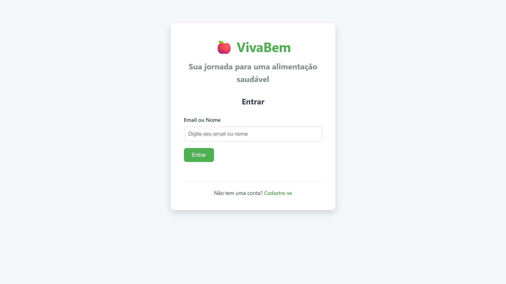
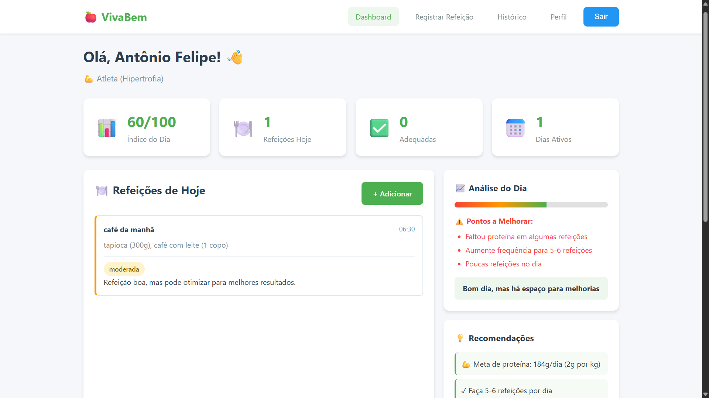
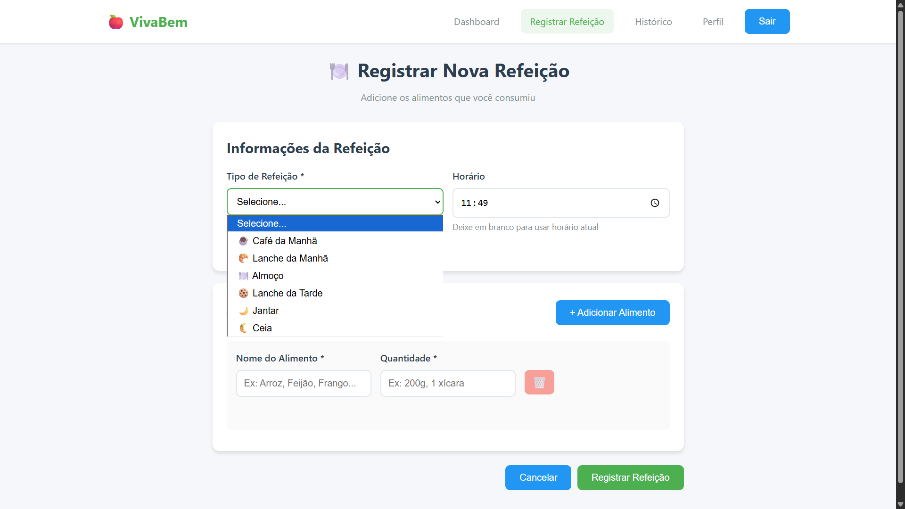
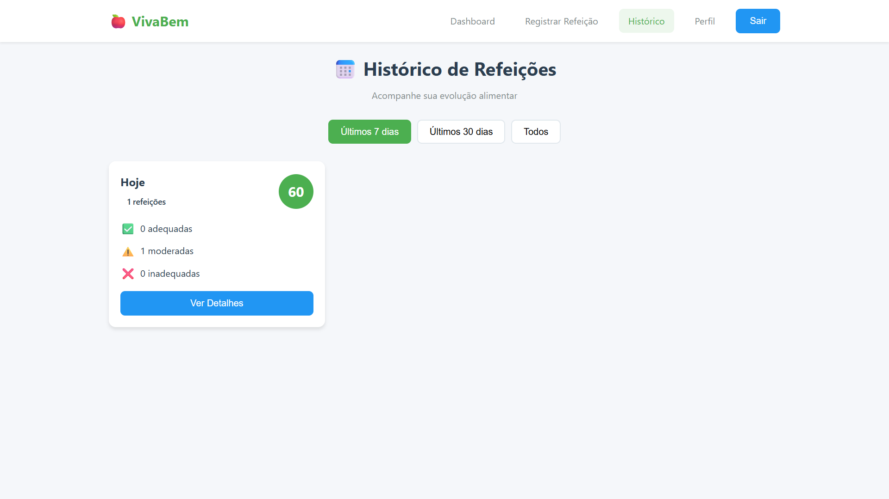
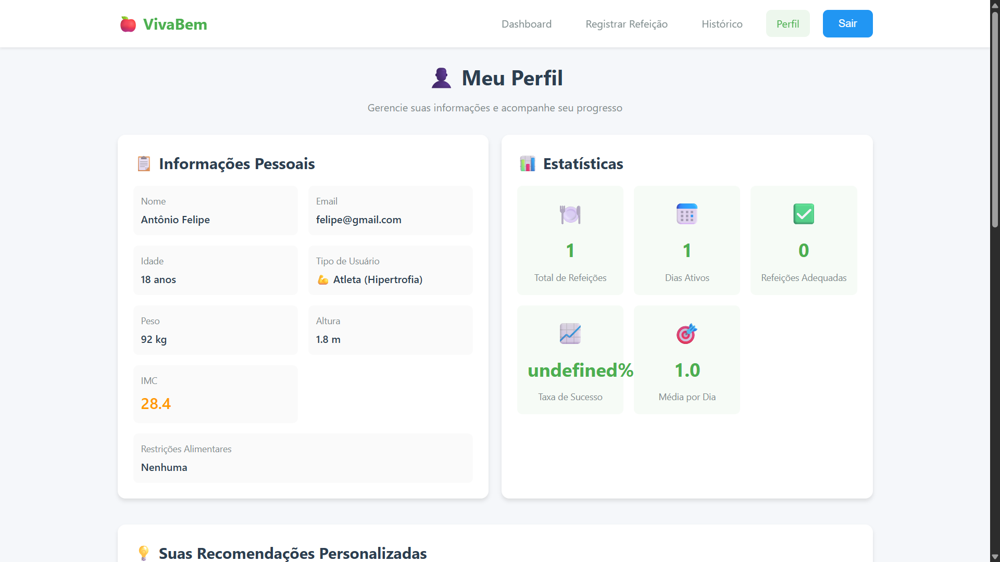
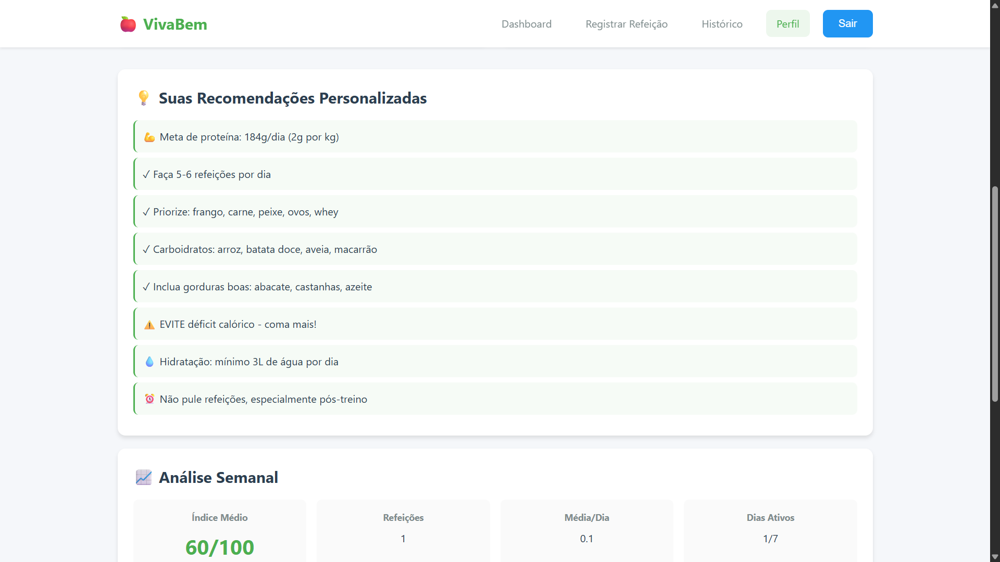
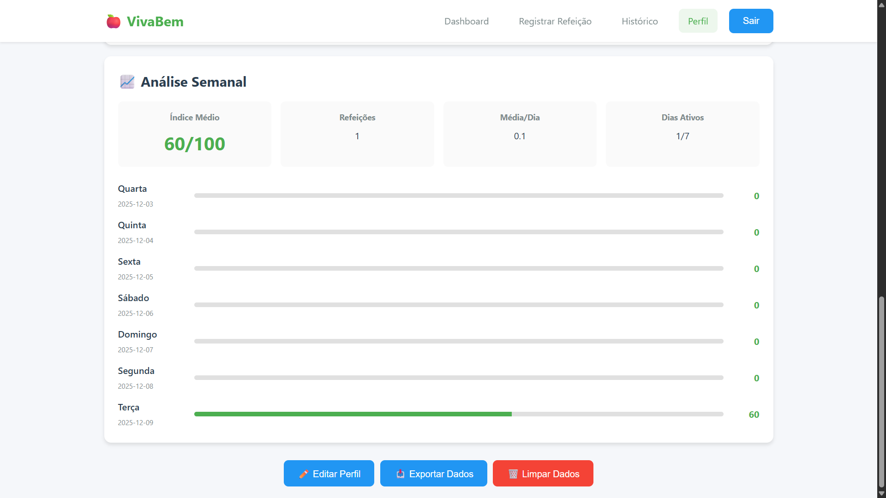

# 🍎 VivaBem - Plataforma de Acompanhamento Alimentar


> Sistema completo de acompanhamento e análise alimentar desenvolvido com JavaScript e Programação Orientada a Objetos

## 📋 Índice

- [Sobre o Projeto](#-sobre-o-projeto)
- [Demonstração](#-demonstração)
- [Funcionalidades](#-funcionalidades)
- [Tecnologias](#-tecnologias)
- [Arquitetura POO](#-arquitetura-poo)
- [Instalação](#-instalação)
- [Uso](#-uso)
- [Estrutura do Projeto](#-estrutura-do-projeto)
- [API Endpoints](#-api-endpoints)
- [Tipos de Usuário](#-tipos-de-usuário)
- [Contribuindo](#-contribuindo)
- [Licença](#-licença)
- [Autores](#-autores)

---

## 🎯 Sobre o Projeto

O **VivaBem** é uma plataforma web desenvolvida como projeto final da disciplina de **Programação Orientada a Objetos (POO)** com JavaScript. O sistema permite que usuários registrem suas refeições, recebam análises personalizadas baseadas em seu perfil e acompanhem sua evolução alimentar ao longo do tempo.

### 🎓 Objetivos Acadêmicos

- Demonstrar aplicação prática dos **4 pilares da POO**:
  - ✅ **Encapsulamento**: Atributos privados com getters/setters
  - ✅ **Herança**: Especialização de usuários (Comum, Diabético, Atleta)
  - ✅ **Polimorfismo**: Análises diferentes por tipo de usuário
  - ✅ **Abstração**: Separação de responsabilidades em camadas

- Implementar arquitetura **MVC** (Model-View-Controller)
- Utilizar **ES6+ Modules** e boas práticas de código
- Criar uma aplicação full-stack funcional

---

## 🖼️ Demonstração

### Tela de Login
Sistema de autenticação simples e intuitivo.


### Dashboard
Visão geral das refeições do dia e análise de qualidade alimentar.


### Registro de Refeições
Formulário dinâmico para adicionar múltiplos alimentos.


### Histórico
Acompanhamento da evolução com análises diárias.


### Perfil
Estatísticas completas e recomendações personalizadas.




---

## ✨ Funcionalidades

### 👤 Gestão de Usuários
- ✅ Cadastro com informações pessoais (nome, idade, peso, altura)
- ✅ Sistema de login por email ou nome
- ✅ Três perfis de usuário: Comum, Diabético e Atleta
- ✅ Cálculo automático de IMC
- ✅ Gestão de restrições alimentares

### 🍽️ Registro de Refeições
- ✅ Adicionar múltiplos alimentos por refeição
- ✅ 6 tipos de refeição (Café da manhã, Almoço, Jantar, etc.)
- ✅ Registro de quantidade e horário
- ✅ **Análise automática** após cada registro

### 📊 Análises Inteligentes
- ✅ **Análise por Refeição**: Feedback imediato com status (adequada/moderada/inadequada)
- ✅ **Análise Diária**: Índice de qualidade (0-100) com pontos positivos e negativos
- ✅ **Análise Semanal**: Evolução dos últimos 7 dias
- ✅ **Análise Mensal**: Estatísticas de 30 dias
- ✅ **Recomendações Personalizadas**: Baseadas no tipo de usuário e comportamento

### 📈 Acompanhamento
- ✅ Dashboard com estatísticas em tempo real
- ✅ Histórico completo de refeições
- ✅ Gráficos de evolução semanal
- ✅ Exportação de dados em JSON

---

## 🛠️ Tecnologias

### Backend
- **Node.js** (v14+)
- **Express.js** - Framework web
- **ES6+ Modules** - Sistema de módulos
- **node-localstorage** - Persistência de dados

### Frontend
- **HTML5** - Estrutura semântica
- **CSS3** - Estilização moderna e responsiva
- **Vanilla JavaScript** - Lógica do cliente
- **Fetch API** - Comunicação com backend

### Conceitos Aplicados
- **POO Completa** (Encapsulamento, Herança, Polimorfismo, Abstração)
- **Arquitetura MVC**
- **RESTful API**
- **Design Responsivo**
- **Clean Code**

---

## 🏗️ Arquitetura POO

### Diagrama de Classes

```
                    ┌─────────────┐
                    │   Usuario   │
                    │  (abstrata) │
                    └──────┬──────┘
                           │
        ┌──────────────────┼─────────────────┐
        │                  │                 │
┌───────▼────────┐  ┌──────▼──────┐  ┌───────▼────────┐
│ UsuarioComum   │  │UsuarioDiabet│  │ UsuarioAtleta  │
│                │  │    ico      │  │                │
│analisarRefeic()│  │analisarRefei│  │analisarRefeic()│
└────────────────┘  └─────────────┘  └────────────────┘
```

### Hierarquia de Classes

#### 🔹 Models

**Usuario** (Classe Base)
```javascript
class Usuario {
  #id, #nome, #email, #idade, #peso, #altura
  // Métodos abstratos sobrescritos pelas subclasses:
  analisarRefeicao(refeicao)
  gerarRecomendacoes()
}
```

**UsuarioComum** (Herança)
- Foco em alimentação equilibrada
- Evita ultraprocessados
- Controla porções

**UsuarioDiabetico** (Herança)
- Controle rigoroso de carboidratos
- Evita alto índice glicêmico
- Prioriza carboidratos complexos

**UsuarioAtleta** (Herança)
- Alta ingestão de proteínas
- Superávit calórico
- Frequência de 5-6 refeições

**Refeicao**
```javascript
class Refeicao {
  #id, #tipo, #alimentos, #horario, #data, #analise
}
```

#### 🔹 Controllers

- **UsuarioController**: Gerencia cadastro, login e perfil
- **RefeicaoController**: Gerencia CRUD de refeições
- **AnaliseController**: Gera análises e recomendações

#### 🔹 Services

- **db.js**: Abstração do sistema de persistência com node-localstorage

---

## 📦 Instalação

### Pré-requisitos

- Node.js (v14 ou superior)
- npm ou yarn

### Passo a Passo

1. **Clone o repositório**
```bash
git clone https://github.com/Felipe-Silva7/Projeto-final-de-POO.git
cd Projeto-final-de-POO 
```

2. **Instale as dependências**
```bash
npm install
```

3. **Inicie o servidor**
```bash
npm start
```

4. **Acesse no navegador**
```
http://localhost:3000
```

### Scripts Disponíveis

```bash
# Iniciar servidor
npm start

# Modo desenvolvimento (com nodemon)
npm run dev
```

---

## 🚀 Uso

### 1. Criar uma Conta

1. Acesse `http://localhost:3000`
2. Clique em "Cadastre-se"
3. Preencha suas informações:
   - Nome, Email, Idade, Peso, Altura
   - Escolha seu tipo: Comum, Diabético ou Atleta
   - (Opcional) Adicione restrições alimentares

### 2. Fazer Login

1. Insira seu email ou nome
2. Acesse o dashboard

### 3. Registrar uma Refeição

1. Clique em "Registrar Refeição"
2. Selecione o tipo (Café da manhã, Almoço, etc.)
3. Adicione os alimentos:
   - Nome do alimento
   - Quantidade (ex: 200g, 1 xícara)
4. Clique em "Registrar"
5. **Receba análise instantânea!**

### 4. Acompanhar Evolução

- **Dashboard**: Veja refeições do dia e índice de qualidade
- **Histórico**: Consulte dias anteriores com detalhes
- **Perfil**: Visualize estatísticas completas e recomendações

---

## 📂 Estrutura do Projeto

```
vivabem/
├── data/                           # Dados persistidos (criado automaticamente)
│   ├── vivabem_usuarios
│   └── vivabem_usuario_logado
│
├── src/
│   ├── models/                     # Camada de Modelos (POO)
│   │   ├── Usuario/
│   │   │   ├── Usuario.js         # Classe base
│   │   │   ├── UsuarioComum.js
│   │   │   ├── UsuarioDiabetico.js
│   │   │   └── UsuarioAtleta.js
│   │   ├── Refeicao/
│   │   │   └── Refeicao.js
│   │   └── Analise/
│   │       ├── AnaliseRefeicao.js
│   │       └── AnaliseUsuario.js
│   │
│   ├── controllers/                # Camada de Controle
│   │   ├── UsuarioController.js
│   │   ├── RefeicaoController.js
│   │   └── AnaliseController.js
│   │
│   ├── services/                   # Serviços
│   │   └── db.js                  # Persistência de dados
│   │
│   ├── routes/                     # Rotas da API
│   │   ├── index_route.js
│   │   ├── usuario_route.js
│   │   ├── refeicao_route.js
│   │   └── analise_route.js
│   │
│   ├── views/                      # Camada de Visualização
│   │   ├── static/
│   │   │   └── index.css          # Estilos
│   │   └── templates/
│   │       ├── login.html
│   │       ├── cadastro.html
│   │       ├── dashboard.html
│   │       ├── registrar.html
│   │       ├── historico.html
│   │       └── perfil.html
│   │
│   └── app.js                      # Configuração Express
│
├── server.js                       # Servidor principal
├── package.json                    # Dependências
└── README.md                       # Este arquivo
```

---

## 🔌 API Endpoints

### Usuários

| Método | Endpoint | Descrição |
|--------|----------|-----------|
| POST | `/api/usuarios/cadastrar` | Cadastra novo usuário |
| POST | `/api/usuarios/login` | Realiza login |
| POST | `/api/usuarios/logout` | Realiza logout |
| GET | `/api/usuarios/logado` | Retorna usuário logado |
| GET | `/api/usuarios/perfil/:id` | Retorna perfil completo |
| PUT | `/api/usuarios/:id` | Atualiza usuário |
| DELETE | `/api/usuarios/:id` | Exclui usuário |

### Refeições

| Método | Endpoint | Descrição |
|--------|----------|-----------|
| POST | `/api/refeicoes/registrar` | Registra nova refeição |
| GET | `/api/refeicoes/usuario/:id` | Lista todas refeições |
| GET | `/api/refeicoes/usuario/:id/hoje` | Refeições do dia |
| GET | `/api/refeicoes/usuario/:id/data/:data` | Refeições por data |
| GET | `/api/refeicoes/usuario/:id/historico` | Histórico completo |
| GET | `/api/refeicoes/usuario/:id/estatisticas` | Estatísticas |
| DELETE | `/api/refeicoes/:userId/:refeicaoId` | Exclui refeição |

### Análises

| Método | Endpoint | Descrição |
|--------|----------|-----------|
| GET | `/api/analises/diaria/:id` | Análise do dia atual |
| GET | `/api/analises/diaria/:id/:data` | Análise de data específica |
| GET | `/api/analises/semanal/:id` | Análise dos últimos 7 dias |
| GET | `/api/analises/mensal/:id` | Análise dos últimos 30 dias |
| GET | `/api/analises/recomendacoes/:id` | Recomendações personalizadas |
| POST | `/api/analises/comparar/:id` | Compara dois períodos |

---

## 👥 Tipos de Usuário

### 🙂 Usuário Comum

**Objetivo**: Alimentação equilibrada e saudável

**Análise Foca em**:
- Priorizar alimentos naturais
- Evitar ultraprocessados
- Manter porções equilibradas

**Recomendações**:
- Frutas e verduras em todas refeições
- Hidratação adequada
- Variedade alimentar

**Exemplo de Análise**:
```
Status: Adequada ✅
✓ Ótima escolha de alimentos naturais
✓ Porção equilibrada
⚠️ Evite alimentos ultraprocessados
```

---

### 💉 Usuário Diabético

**Objetivo**: Controle glicêmico rigoroso

**Análise Foca em**:
- Evitar carboidratos simples (alto IG)
- Priorizar carboidratos complexos
- Controlar quantidade total de carboidratos
- Incluir fibras em todas refeições

**Recomendações**:
- 🚫 EVITE: açúcares, doces, refrigerantes
- ✓ PRIORIZE: arroz integral, aveia, quinoa
- ✓ Proteínas em todas refeições
- ✓ Aumente consumo de fibras

**Exemplo de Análise**:
```
Status: Inadequada ❌
⚠️ ATENÇÃO: Carboidratos simples detectados!
⚠️ Alto índice glicêmico
⚠️ Quantidade de carboidratos muito alta
```

---

### 💪 Usuário Atleta (Hipertrofia)

**Objetivo**: Ganho de massa muscular

**Análise Foca em**:
- Alta ingestão de proteínas (2g/kg)
- Superávit calórico
- Carboidratos complexos para energia
- Frequência de 5-6 refeições/dia

**Recomendações**:
- 💪 Meta de proteína: 140g/dia (exemplo para 70kg)
- ✓ Faça 5-6 refeições por dia
- ✓ Priorize: frango, carne, peixe, ovos, whey
- ⚠️ EVITE déficit calórico

**Exemplo de Análise**:
```
Status: Adequada ✅
💪 Excelente! Proteínas presentes
✓ Quantidade de proteína adequada (200g)
✓ Carboidratos complexos para energia
✓ Refeição volumosa, ótimo para ganho de massa
```

---

## 🎨 Design e UX

### Princípios de Design

- **Simplicidade**: Interface limpa e intuitiva
- **Responsividade**: Funciona em desktop e mobile
- **Feedback Visual**: Status coloridos (verde/amarelo/vermelho)
- **Acessibilidade**: Cores com bom contraste

### Sistema de Cores

```css
--primary: #4CAF50     /* Verde - Principal */
--secondary: #2196F3   /* Azul - Secundário */
--success: #4CAF50     /* Verde - Sucesso */
--warning: #ff9800     /* Laranja - Aviso */
--error: #f44336       /* Vermelho - Erro */
```

### Status das Refeições

| Status | Cor | Significado |
|--------|-----|-------------|
| ✅ Adequada | Verde | Atende maioria das recomendações |
| ⚠️ Moderada | Laranja | Possui pontos positivos e alertas |
| ❌ Inadequada | Vermelho | Viola restrições ou contraria objetivos |

---

## 🧪 Testando o Sistema

### Fluxo de Teste Recomendado

1. **Cadastre 3 usuários** (um de cada tipo)
2. **Registre diferentes refeições**:
   - Usuário Comum: Arroz, feijão, salada, frango
   - Usuário Diabético: Arroz integral, frango, brócolis
   - Usuário Atleta: Frango 300g, batata doce, arroz
3. **Compare as análises** recebidas
4. **Acompanhe o histórico** após alguns dias
5. **Exporte os dados** do perfil

### Casos de Teste

#### Teste 1: Análise Polimórfica
```javascript
// Mesma refeição, análises diferentes
Refeição: Arroz branco 200g, Frango 150g

Comum: Status Adequada ✅
Diabético: Status Moderada ⚠️ (arroz branco = alto IG)
Atleta: Status Moderada ⚠️ (pouca proteína)
```

#### Teste 2: Restrições
```javascript
// Usuário com restrição: lactose
Refeição: Leite, Queijo

Resultado: Status Inadequada ❌
"Atenção: contém lactose (restrição cadastrada)"
```

---

## 📊 Demonstração de POO

### Encapsulamento
```javascript
class Usuario {
  #nome;  // Atributo privado
  
  get nome() { return this.#nome; }  // Getter público
  
  set nome(valor) {  // Setter com validação
    if (!valor) throw new Error('Nome obrigatório');
    this.#nome = valor;
  }
}
```

### Herança
```javascript
class UsuarioDiabetico extends Usuario {
  // Herda todos atributos e métodos de Usuario
  constructor(id, nome, email...) {
    super(id, nome, email, idade, peso, altura, 'diabetico');
  }
}
```

### Polimorfismo
```javascript
// Mesmo método, comportamento diferente
usuarioComum.analisarRefeicao(refeicao);     // → Foca em naturais
usuarioDiabetico.analisarRefeicao(refeicao); // → Foca em carboidratos
usuarioAtleta.analisarRefeicao(refeicao);    // → Foca em proteínas
```

### Abstração
```javascript
// AnaliseRefeicao abstrai a complexidade
const analise = new AnaliseRefeicao(refeicao, usuario);
const resultado = analise.executarAnalise();
// Internamente delega para o método polimórfico do usuário
```

```javascript
// Classe Usuario funciona como uma abstração de um "tipo de usuário"
// Não pode ser instanciada diretamente (classe abstrata)
export class Usuario {
  #id;
  #nome;
  #email;
  #idade;
  #peso;
  #altura;
  #tipo;
  #restricoes;
  #refeicoes;

  constructor(id, nome, email, idade, peso, altura, tipo, restricoes = []) {
    // Garante que a classe só seja usada por subclasses
    if (this.constructor === Usuario) {
      throw new Error("Classe Usuario é abstrata e não pode ser instanciada diretamente.");
    }

    // Atributos encapsulados representam a estrutura comum a qualquer usuário
    this.#id = id;
    this.#nome = nome;
    this.#email = email;
    this.#idade = idade;
    this.#peso = peso;
    this.#altura = altura;
    this.#tipo = tipo;
    this.#restricoes = restricoes;
    this.#refeicoes = []; // Cada usuário gerencia suas próprias refeições
  }
}

```

---

## 🤝 Contribuindo

Contribuições são bem-vindas! Siga os passos:

1. Fork o projeto
2. Crie uma branch para sua feature (`git checkout -b feature/NovaFuncionalidade`)
3. Commit suas mudanças (`git commit -m 'Adiciona nova funcionalidade'`)
4. Push para a branch (`git push origin feature/NovaFuncionalidade`)
5. Abra um Pull Request

### Padrões de Código

- Use ES6+ features
- Mantenha a POO (não quebre encapsulamento)
- Adicione JSDoc nos métodos públicos
- Siga o estilo de código existente

---

## 📝 Licença

Este projeto está sob a licença MIT. Veja o arquivo [LICENSE](LICENSE) para mais detalhes.

---

## 👨‍💻 Autores

- **Felipe Silva** - *Dev full stack* - [GitHub](https://github.com/Felipe-Silva7)
- **Maria da Consolação** - *Designer* - [GitHub](https://github.com/jahahshz5-hash)

---

## 📞 Contato

- Email: fs0987145@gmail.com
- LinkedIn: [Felipe Silva](www.linkedin.com/in/felipe-silva-backend)
- GitHub: [@Felipe-Silva7](https://github.com/Felipe-Silva7)

---

<div align="center">

[⬆ Voltar ao topo](#-vivabem---plataforma-de-acompanhamento-alimentar)

</div>
